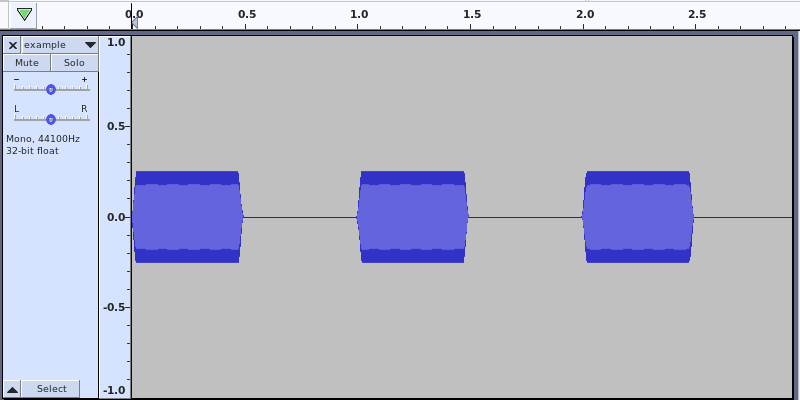
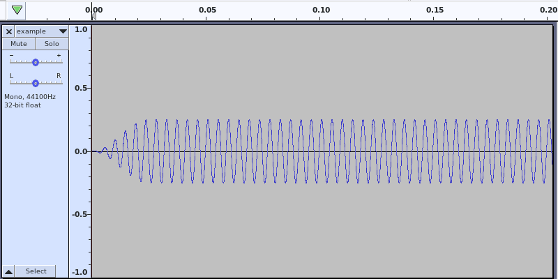

# Command line options

Here's the full help:

    Usage: soxbeep.sh -o OUTPUT_FILE -F FREQ
    Required:
      -o | --output OUTPUT_FILE     - output file
      -F | --freq FREQ              - beep tone frequency

    Optional:
      -f | --force                  - force overwrite
      -l | --length LENGTH          - length of a single beep in seconds    (default: 1.0)
      -d | --duty DUTY              - duty cycle, a part of LENGTH the tone is on,
                                      including fade-in and fade-out        (default: 0.5)
      -c | --count COUNT            - number of beeps                       (default: 1)
      -n | --norm NORM              - normalize level in dBFS               (default: -0.1)
      -h | --help                   - this help message

    Generates 24 / 44.1k file.

The example was geneated with:

    ]$ ./soxbeep.sh -o example.flac --freq 220 --count 3 --norm -12

