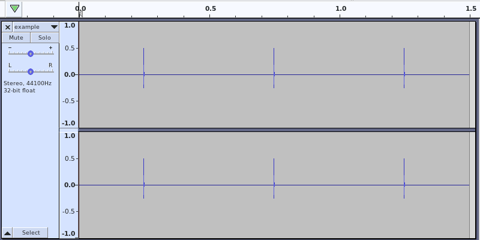
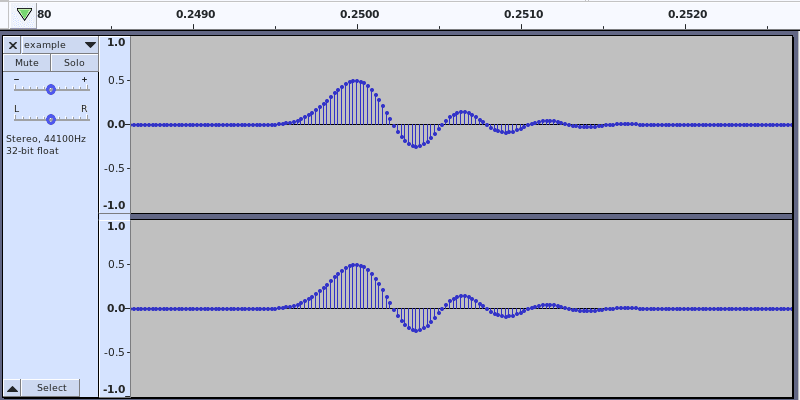

# Command line options

Here's the full help:

    Usage: soxknock.sh -o OUTPUT_FILE
    Required:
      -o | --output OUTPUT_FILE     - output file

    Optional:
      -f | --force                  - force overwrite
      -p | --pad PAD                - pad in samples            (default: 11025)
      -c | --count COUNT            - count                     (default: 1)
      -n | --norm NORM              - normalize level in dBFS   (default: -0.1)
      -b | --band BAND              - band                      (default: -2000)
      -d | --delay DELAY            - delay of the right channel in samples (default: 0)
      -h | --help                   - this help message

    Generates 24 / 44.1k file.

The example was generated with:

    ]$ soxknock.sh -o example.flac --count 3 --norm -6

