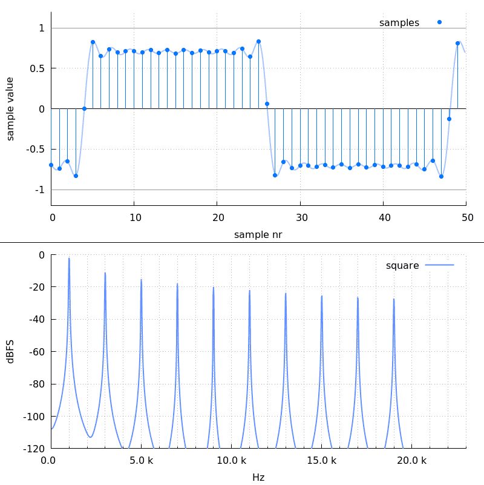
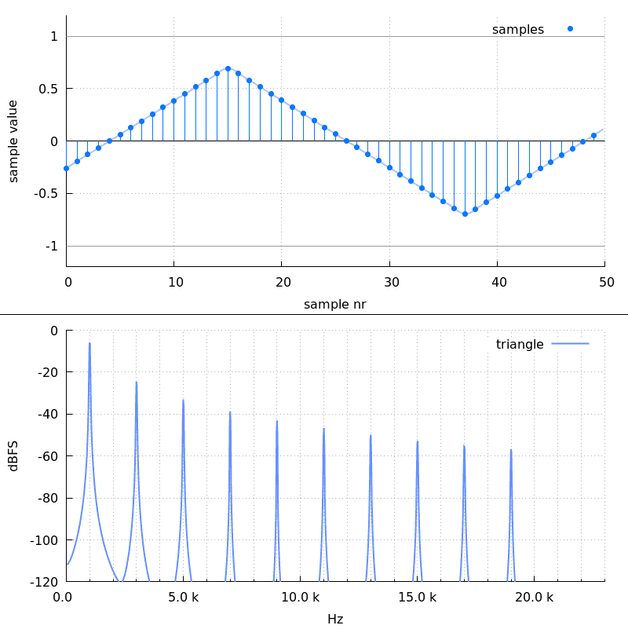
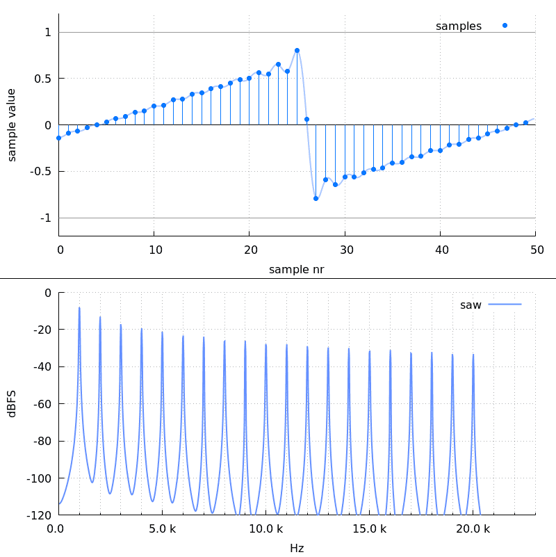
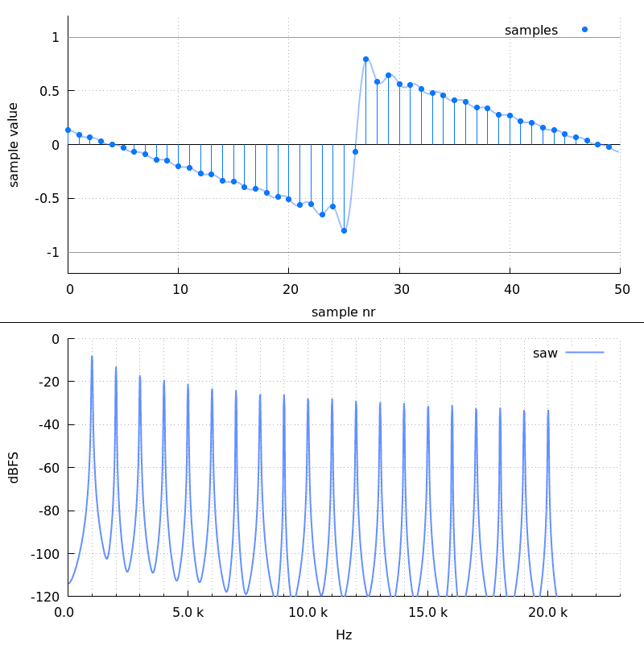

# Command line options

Here's the full help:

    Usage:
      soxsquare.sh -o FILENAME

      Required:
        -o | --output FILENAME              - output filename

      Optional:
        -f | --force                        - force overwrite
        -a | --amplitude AMPLITUDE_DBFS     - amplitude of the wave in dBFS (samples may exceed it, default: -20)
        -A | --peak-sample AMPLITUDE_DBFS   - peak sample in dBFS
        -d | --duration DURATION            - duration in SoX format (default: 5)
        -F | --frequency FREQUENCY          - frequency in Hz (default: 440)
        -t | --type TYPE                    - type (default: square)
        -h | --help                         - this help message

    Generates bandlimited wave of type TYPE: square, triangle, saw, reversedsaw.

    Duration accepts sox format.

    --amplitude and --peak-sample are mutually exclusive.

The square example was generated with:

    ]$ soxsquare.sh -o square.flac --amplitude -3 --frequency 1000 --duration 2

The triangle example was geneated with:

    ]$ soxsquare.sh -o square.flac --amplitude -3 --frequency 1000 --duration 2 --type triangle

The saw example was generated with:

    ]$ soxsquare.sh -o square.flac --amplitude -3 --frequency 1000 --duration 2 --type saw

The reversedsaw example was generated with:

    ]$ soxsquare.sh -o square.flac --amplitude -3 --frequency 1000 --duration 2 --type reversedsaw

